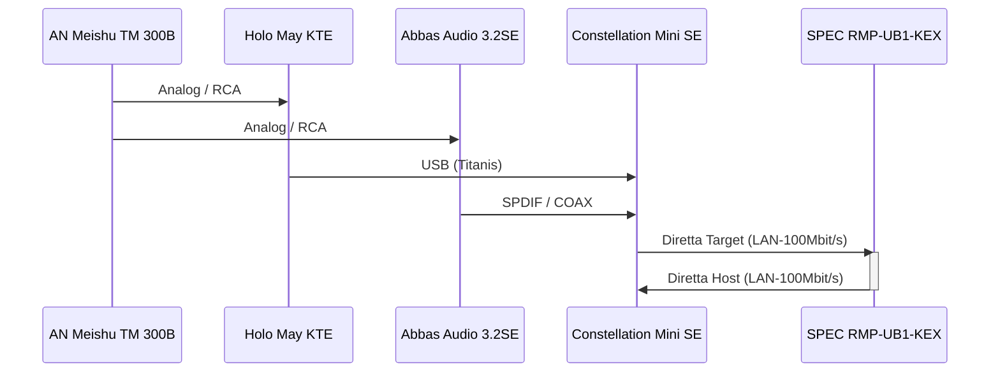

# DIRETTA - HiFi-Chain #1

`Speaker:` `DeVore O96 Reference revised with active Subwoofer (RobF)`

## AMP: Meishu Tonmeister 300b Silver Signature

```mermaid
sequenceDiagram
    AN Meishu TM 300B->>Holo May KTE: Analog / RCA
    AN Meishu TM 300B->>Abbas Audio 3.2SE: Analog / RCA
    Holo May KTE->>Constellation Mini SE: USB (Titanis)
    Abbas Audio 3.2SE->>Constellation Mini SE: SPDIF / COAX
    Constellation Mini SE->>SPEC RMP-UB1-KEX: Diretta Target (LAN-100Mbit/s)
    activate SPEC RMP-UB1-KEX
    SPEC RMP-UB1-KEX->>Constellation Mini SE: Diretta Host (LAN-100Mbit/s)
    deactivate SPEC RMP-UB1-KEX
```
