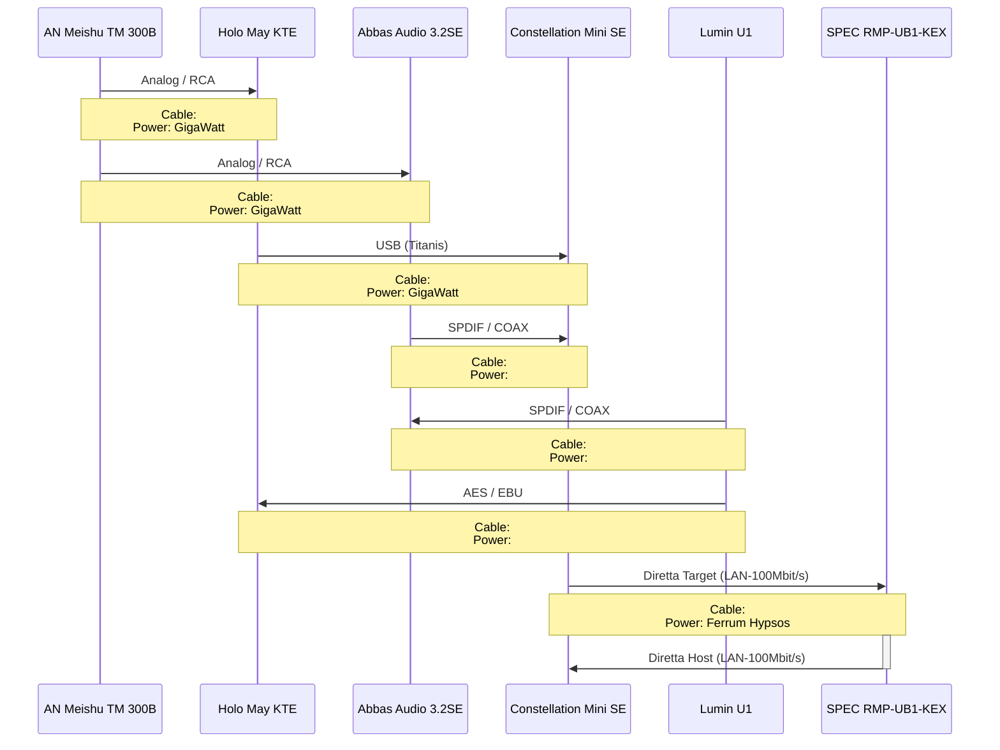

# DIRETTA - HiFi-Chain #1

`Speaker:` `DeVore O96 Reference - complete rebuild with active Subwoofer (RobF)`

`LAN Chaining:` `Power of Ethernet <> OXCO <> Paul Pang Dual`

## AMP: Meishu Tonmeister 300b Silver Signature

