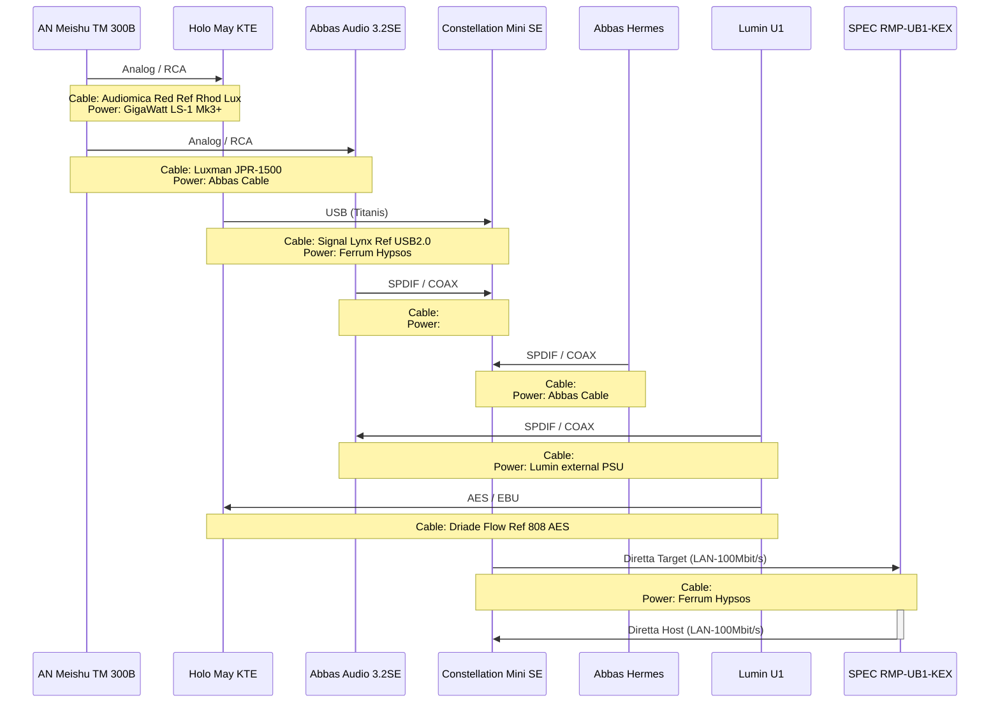
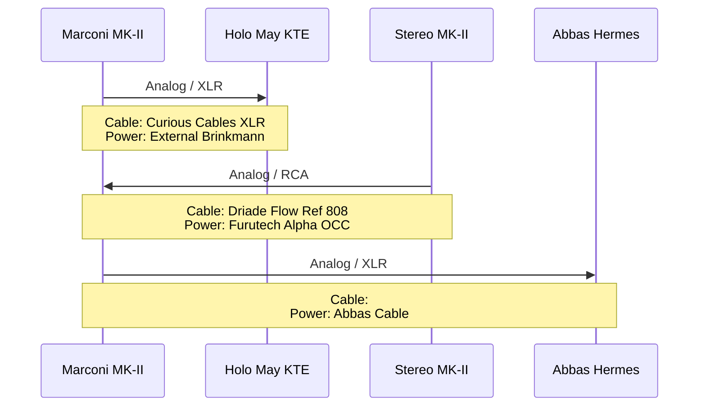

# DIRETTA - HiFi-Chain #1

`Speaker:` `DeVore O96 Reference - complete rebuild with active Subwoofer (RobF)` \
`Speaker cable:` `Driade Flow Reference 808 Copper G`

`LAN Chaining:` `Power of Ethernet <> OXCO <> Paul Pang Dual`

## Digital Sources

- **Grimm Audio MU2 - Roon Core**
- **Lumin U1 Streamer - Roon Bridge**
- **Pachanko Labs Constellation Mini SE - Roon/Diretta Host**
- **SPEC RMP-UB1SFP-KEX - Roon/Diretta Target**
- **Abbas Audio 3.2SE (TDA1541A) - DAC only**
- **Abbas Audio Hermes Sig (PCM63P-K) - DAC only**
- **Holo Audio May KTE - DAC only**
- **Sony CDP X505ES Swoboda full-modification - CD Player (internal DAC)**
- **Cyrus CDi with external PSU - CD Transport (Abbas DAC)**

## AMP: Meishu Tonmeister 300b Silver Signature

---

## Pre/AMP: Brinkmann Audio Marconi MK-II (Pre) / Brinkmann Stereo MK-II (AMP)

