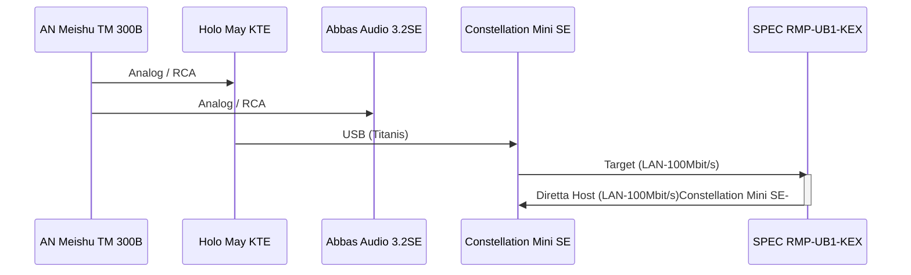

# Setup HiFi-Chain #1

```mermaid
sequenceDiagram
    AN Meishu TM 300B->>Holo May KTE: Analog / RCA
    AN Meishu TM 300B->>Abbas Audio 3.2SE: Analog / RCA
    Holo May KTE->>Constellation Mini SE: USB (Titanis)
    Constellation Mini SE->>SPEC RMP-UB1-KEX: Target (LAN-100Mbit/s)
    activate SPEC RMP-UB1-KEX
    SPEC RMP-UB1-KEX->>Constellation Mini SE: Diretta Host (LAN-100Mbit/s)Constellation Mini SE-
    deactivate SPEC RMP-UB1-KEX
```
