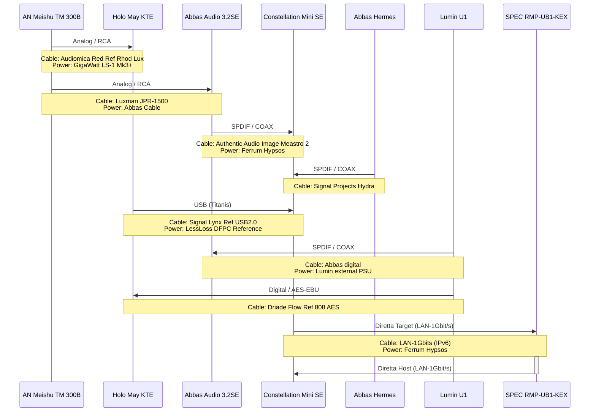
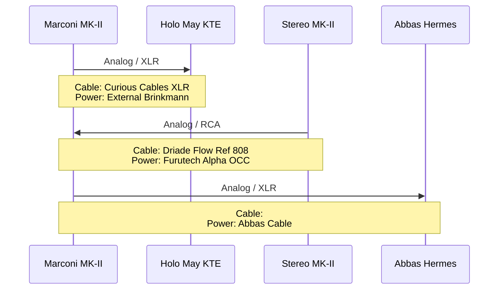
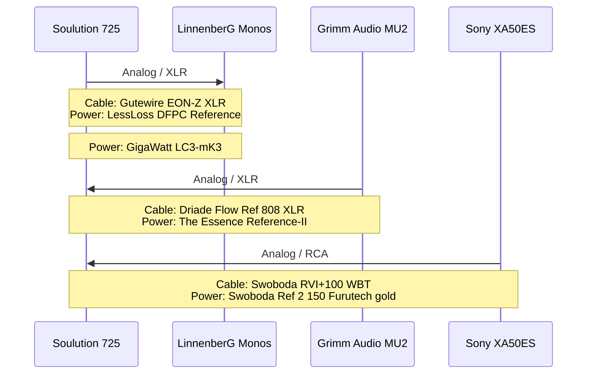

`Last update:`  `Aug 7th`

# Streaming

- **Primary APP:** Roon
- **Music Provider:** Qobuz Studio
- **Podcasts:** Spotify Premium
- **On-The-Road:** Spotify, Soundcloud, Roon ARC, YT-Premium, Amazon PRIME Music

# Digital Sources

- **Grimm Audio MU2 - Roon Core**
  - Volume: fixed, through Soulution 725 Pre-AMP
- **Lumin U1 Streamer - Roon Bridge**
  - Volume: fixed, through AN 300B or Brinkmann Marconi Pre-AMP
- **Pachanko Labs Constellation Mini SE - Roon/Diretta Host**
- **SPEC RMP-UB1SFP-KEX - Roon/Diretta Target**
- **Abbas Audio 3.2SE (TDA1541A) - DAC only**
- **Abbas Audio Hermes Sig (PCM63P-K) - DAC only**
- **Holo Audio May KTE - DAC only**
- **Sony CDP XA50ES Swoboda highest-modification - CD Player (internal DAC + SPDIF)**
- **Sony CDP X505ES Swoboda full-modification - CD Player (internal DAC + TOSLINK)**
- **Cyrus CDi with external PSU - CD Transport (Abbas DAC + Holo May/SPDIF)**

---

# DIGITAL ONLY - HiFi-Chain #2

`Speaker:` `DeVore O96 Reference - complete rebuild with active Subwoofer (RobF)`

`Speaker cable:` `Driade Flow Reference 808 Copper G 3m / Inakustik LS2404-MK2 3m`

`Speaker spikes:` `DIY wood-stand, marble slap and with basotec foam pads under speaker and slap`

`LAN Chaining:` `Devolo Powerline <> OXCO TeraTek<> Paul Pang Dual`

`Power Conditioner:` `AudioQuest Niagara 3000 (AN 300B,CD-Cyrus,CD-Sony,Abbas DAC,Constellation)`

`Netzleiste:` `Cardas Audio Nautilus (der Rest)`

## AMP: Meishu Tonmeister 300b Silver Signature

---

## Pre/AMP: Brinkmann Audio Marconi MK-II (Pre) / Brinkmann Stereo MK-II (AMP)

---

# DIGITAL ONLY - HiFi-Chain #1

`Speaker:` `ELAC Concentro S507 (v1)`

`Speaker cable:` `Inakustik LS2404-MK2 Bi-Wire to Single-Wire 4m`

`Speaker spikes:` `Stackaudio Auva 100 with felt pads`

`LAN Chaining:` `Devolo Powerline <> Paul Pang Quad`

`Power Conditioner:` `Stromtank S-1000 (Monos,Grimm MU2,Soulution)`

`Netzleiste:` `Cardas Audio Nautilus (CD-Player,PaulPang)`

---

## Pre/AMP: Soulution 725 (Pre) / LinnenberG G.F.Händel Monos (AMP)

---
