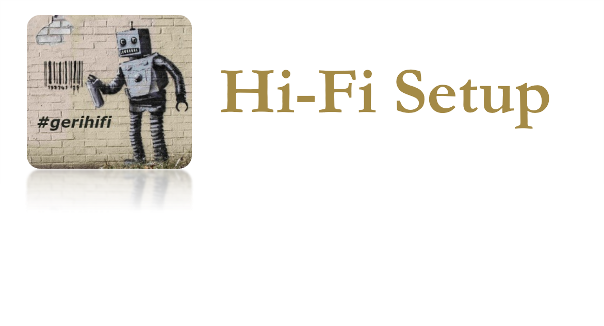
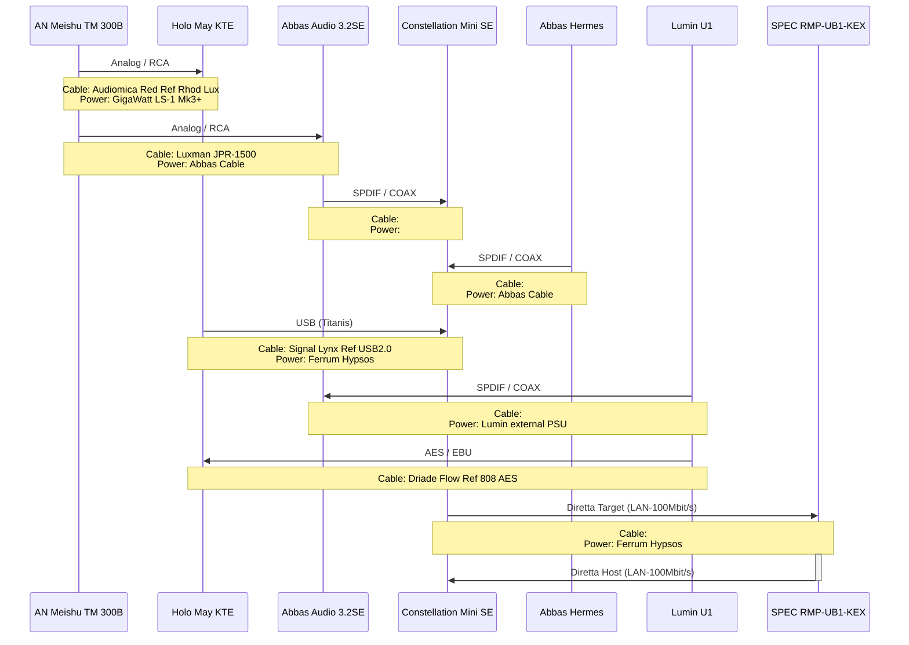
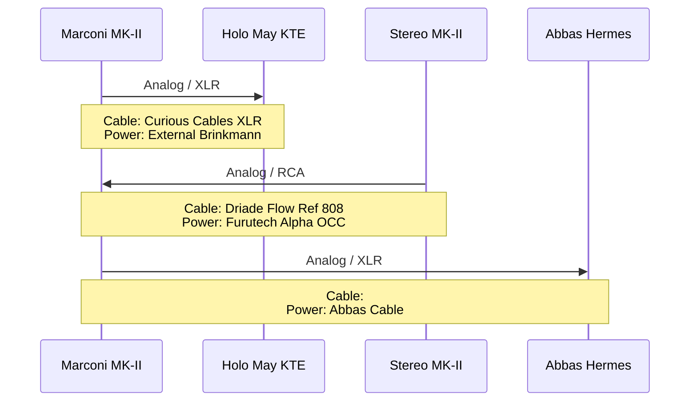
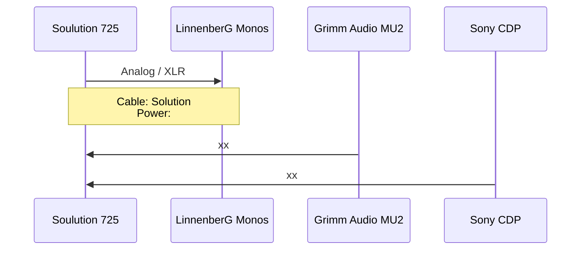

# Streaming

- **Primary APP: Roon, Roon ARC**
- **Music Provider: Qobuz Studio**
- **Podcasts: Spotify Premium**
- **On-The-Road: Spotify, Soundcloud, Roon ARC, YT-Premium, Amazon PRIME Music**

# Digital Sources

- **Grimm Audio MU2 - Roon Core**
- **Lumin U1 Streamer - Roon Bridge**
- **Pachanko Labs Constellation Mini SE - Roon/Diretta Host**
- **SPEC RMP-UB1SFP-KEX - Roon/Diretta Target**
- **Abbas Audio 3.2SE (TDA1541A) - DAC only**
- **Abbas Audio Hermes Sig (PCM63P-K) - DAC only**
- **Holo Audio May KTE - DAC only**
- **Sony CDP XA50ES Swoboda highest-modification - CD Player (internal DAC + SPDIF)**
- **Sony CDP X505ES Swoboda full-modification - CD Player (internal DAC + TOSLINK)**
- **Cyrus CDi with external PSU - CD Transport (Abbas DAC)**

---

# DIGITAL ONLY - HiFi-Chain #2

`Speaker:` `DeVore O96 Reference - complete rebuild with active Subwoofer (RobF)`

`Speaker cable:` `Driade Flow Reference 808 Copper G 3m / Inakustik LS2404-MK2 3m`

`LAN Chaining:` `Devolo Powerline <> OXCO TeraTek<> Paul Pang Dual`

## AMP: Meishu Tonmeister 300b Silver Signature

---

## Pre/AMP: Brinkmann Audio Marconi MK-II (Pre) / Brinkmann Stereo MK-II (AMP)

---

# DIGITAL ONLY - HiFi-Chain #1

`Speaker:` `ELAC Concentro S507 (v1)`

`Speaker cable:` `Inakustik LS2404-MK2 Bi-Wire to Single-Wire 4m`

`LAN Chaining:` `Devolo Powerline <> Paul Pang Quad`

---

## Pre/AMP: Soulution 725 (Pre) / LinnenberG G.F.Händel Monos

---
